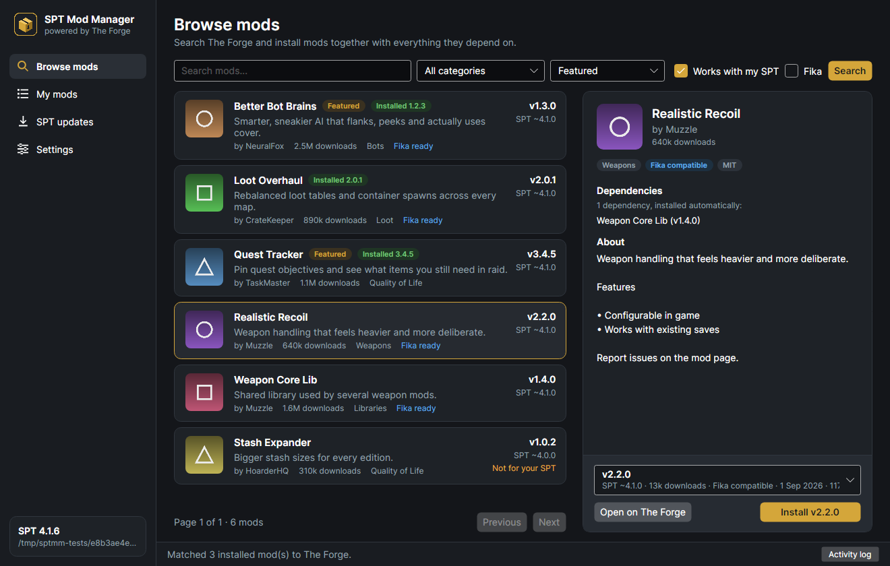
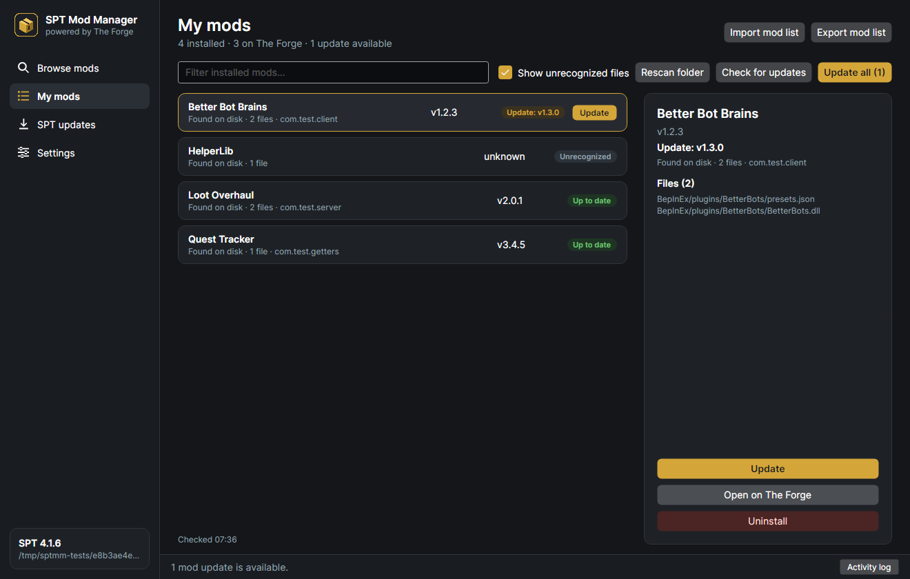
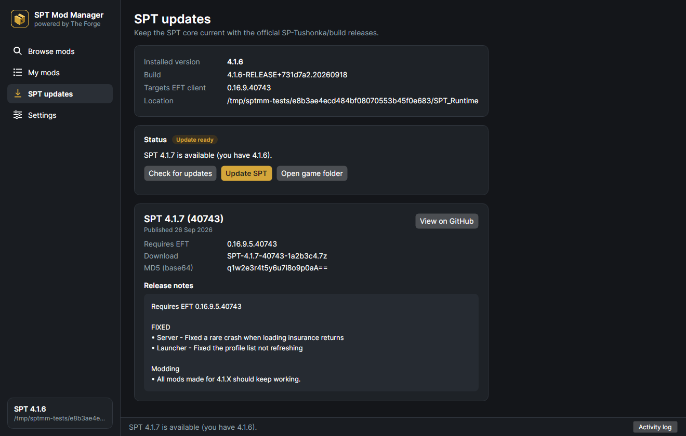

# SPT Mod Manager

A desktop mod manager for [Single Player Tarkov](https://sp-mod.com/). Browse and install mods from
[The Forge](https://sp-mod.com/mods) with their dependencies, keep them updated, and apply SPT patch releases from
[SP-Tushonka/build](https://github.com/SP-Tushonka/build), all from one window. Runs on Windows and Linux.



| My mods | SPT updates |
| --- | --- |
|  |  |

## Features

- **Browse The Forge**: search, filter by category, sort, only show mods that work with your SPT version, filter
  for Fika compatibility, see versions, descriptions and dependencies before installing.
- **Dependency resolution**: installing a mod resolves its full dependency tree through The Forge for your exact SPT
  version. You get a plan ("install X, update Y, keep Z") to confirm before anything is touched, and problems like
  a dependency with no compatible version are called out.
- **Updates**: checks every tracked mod against The Forge's update endpoint, which understands cross-mod constraints,
  so an update that would break another installed mod is shown as held back instead of offered.
- **Picks up mods you installed by hand**: scans `BepInEx/plugins`, `BepInEx/patchers` and `SPT_Runtime/user/mods`,
  reads each mod's GUID and version straight out of its DLL (without loading or running it) and matches it to The
  Forge, so those mods get update checks too.
- **SPT patch updates**: reads the SP-Tushonka/build GitHub releases, finds the direct download link and md5 hash in
  the release notes, checks the release targets the same EFT client build as your install, backs up your profiles,
  verifies the download and extracts it over your install, the same way the
  [official guide](https://github.com/SP-Tushonka/wiki/blob/main/SPT_4x/Updating_SPT.md) describes. Minor/major
  updates (for example 4.1 to 4.2) need a fresh install, so those are reported with a link to the official installer.
- **Mod lists**: export your mods to a `.sptmods.json` file and import a friend's list to install the same set,
  using newer compatible versions when the listed ones do not fit your SPT version.
- **Safe file handling**: every install records exactly which files it wrote, so updates remove leftovers from the
  old version and uninstalls remove only the mod's own files. Config files a mod creates while you play are never
  tracked, so they survive updates. Archive paths are checked so nothing can be written outside the game folder.

## Requirements

- An SPT 4.x install (4.1+ uses the `SPT_Runtime` folder, 4.0 the `SPT` folder; both are detected).
- The [.NET 10 runtime](https://dotnet.microsoft.com/download/dotnet/10.0), the same one SPT 4.1 needs. Self-contained
  builds (see below) do not need it.

## Getting started

1. Run the app and open **Settings**.
2. Pick the folder that contains `EscapeFromTarkov.exe`, `BepInEx` and `SPT_Runtime`, then **Use this folder**.
3. The manager scans your mods and matches them to The Forge. Head to **My mods** to check for updates, or
   **Browse mods** to find new ones.

Close the SPT server, launcher and game before installing, updating or removing mods.

## Building

```bash
# Run from source
dotnet run --project src/SptModManager.App

# Run the tests (core logic + headless UI tests)
dotnet test SptModManager.slnx

# Self-contained single-file builds
dotnet publish src/SptModManager.App -c Release -r win-x64 --self-contained -p:PublishSingleFile=true -p:IncludeNativeLibrariesForSelfExtract=true -o publish/win-x64
dotnet publish src/SptModManager.App -c Release -r linux-x64 --self-contained -p:PublishSingleFile=true -p:IncludeNativeLibrariesForSelfExtract=true -o publish/linux-x64
```

Only the `SptModManager` executable is needed from the publish folder (the `.pdb` files are debug symbols). CI builds
both on every push to `main` and uploads them as workflow artifacts.

The headless UI tests also save screenshots of every page. Set `SPTMM_SCREENSHOT_DIR` to choose where
(`docs/screenshots` is where the images above came from).

## How it works

| Piece | Source |
| --- | --- |
| Mod search, details, versions | Forge API v0: `GET /api/v0/mods`, `/mod/{id}`, `/mod/{id}/versions` |
| Dependency trees | `GET /api/v0/mods/dependencies?mods=id:version&spt_version=x` |
| Update checks | `GET /api/v0/mods/updates?mods=id:version,...&spt_version=x` |
| Grouping a mod's files | `GET /api/v0/mod/{id}/versions/{versionId}/file-tree` |
| Mod downloads | The Forge download link, which redirects to the author's direct `.7z`/`.zip` |
| SPT releases | `GET https://api.github.com/repos/SP-Tushonka/build/releases` |
| Installed SPT version | `AssemblyInformationalVersion` of `SPT_Runtime/SPTarkov.Server.Core.dll` |
| Client mod identity | `[BepInPlugin(guid, name, version)]` attribute in the plugin DLL |
| Server mod identity | The `IModMetadata` implementation's `ModGuid`/`Version` initializers, read from IL |

The Forge API is open and needs no key. Its address and the release repository can be changed under
Settings > Advanced.

What the manager stores:

- `<game folder>/.sptmm/installed.json`: tracked mods and the files they own (travels with the install).
- `<game folder>/.sptmm/backups/`: profile backups taken before SPT updates.
- Settings in `%APPDATA%/SptModManager` (Windows) or `~/.config/SptModManager` (Linux). Set `SPTMM_DATA_DIR` to
  use another folder, for example for a portable setup.

Mod archives are installed into the game folder the way The Forge expects (`BepInEx/...` and
`SPT_Runtime/user/mods/...` at the archive root). Common packaging quirks are handled: a wrapper folder around
everything, the 4.0 `SPT/` root, the old root-level `user/mods/` layout, odd casing of `BepInEx/plugins`, and
archives of bare DLLs. Anything that still does not fit is refused with a message instead of guessed at.

## Mod list format

```json
{
  "format": "spt-mod-manager/mod-list",
  "formatVersion": 1,
  "name": "Mods for SPT 4.1.6",
  "sptVersion": "4.1.6",
  "mods": [
    { "forgeModId": 123, "guid": "com.author.mod", "name": "Some Mod", "version": "1.2.0", "url": "https://sp-mod.com/mods/123/some-mod" }
  ]
}
```

Mods pulled in only as dependencies are left out of exports because importing resolves dependencies again.

## Project layout

```
src/SptModManager.Core     Forge + GitHub clients, install detection, scanning, archive layout, install/update logic
src/SptModManager.App      Avalonia UI (MVVM with CommunityToolkit.Mvvm)
tests/SptModManager.Core.Tests   Unit and integration tests against temp installs
tests/SptModManager.App.Tests    Headless Avalonia tests driving the real view models, plus screenshots
tests/Fixtures             Tiny compiled "mods" (a BepInEx plugin, two server mod styles, a fake SPT core DLL)
```

## Disclaimer

A community tool, not affiliated with SPT, The Forge or Battlestate Games. Mods are made by their authors and
downloaded from wherever they host them; The Forge's VirusTotal links and your own judgement still apply.
